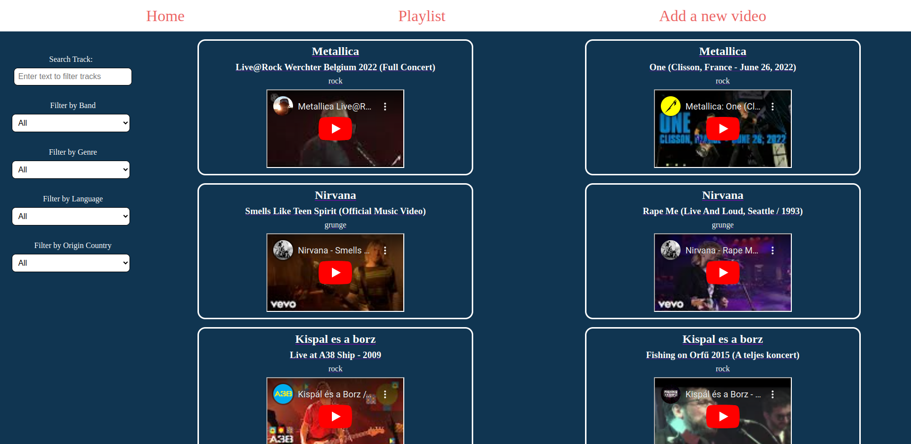
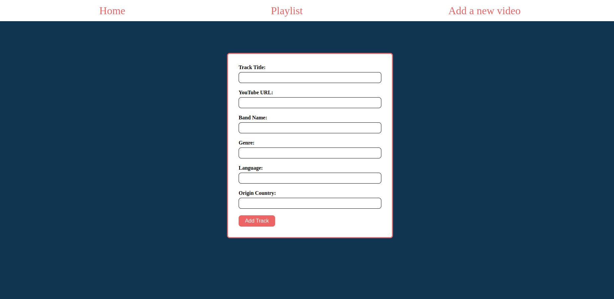

# Playlist App

Manage your YouTube video playlist with ease. Add, update, delete, and play your favorite music videos.

## Table of Contents

- [Features](#features)
- [Tech Stack](#tech-stack)
- [Getting Started](#getting-started)
- [Usage](#usage)
- [Backend](#backend)
- [Scripts](#scripts)
- [Screenshots](#screensshots)

## Features

- Add YouTube videos to your playlist.
- Update video information and details.
- Delete videos from the playlist.
- Play videos directly within the app.

## Tech Stack

### Frontend

- React
- React Router
- TypeScript
- Vite (for development and bundling)
- Sass (for styling)
- ESLint (for code linting)

### Backend

- Java
- Spring Boot
- Hibernate
- RESTful API

## Getting Started

1. Clone this repository.
2. Install the dependencies with `npm install`.

## Usage

1. Run the development server:

   ```
   npm run dev
   ```

2. Launch the backend server.

3. Open your web browser and navigate to `http://localhost:5173` to start using the app.

## Backend

The backend of this app is built using Java, Spring Boot, and Hibernate, providing a robust and efficient API for managing your video playlist.

## Scripts

- `dev`: Start the development server with Vite.
- `build`: Build the app for production using TypeScript and Vite.
- `lint`: Run ESLint to check for code quality and style.
- `preview`: Preview the production build locally.

## Screenshots


_Playlist_


_Add a video to your playlist_
